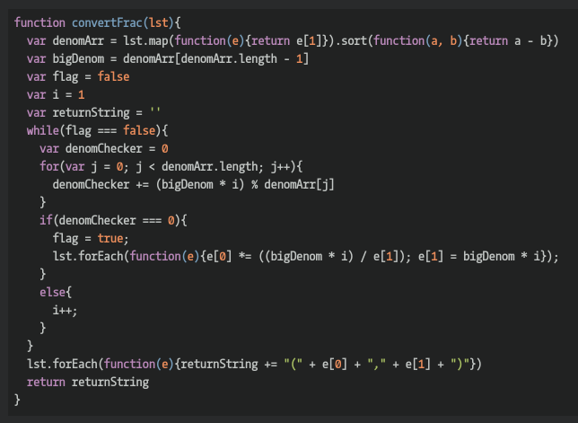

## CodeWars Challenge- 29

You will have a list of rationals in the form

 { {numer_1, denom_1} , ... {numer_n, denom_n} }
or

 [ [numer_1, denom_1] , ... [numer_n, denom_n] ]
or

 [ (numer_1, denom_1) , ... (numer_n, denom_n) ]
where all numbers are positive ints.

You have to produce a result in the form

 (N_1, D) ... (N_n, D)
or

 [ [N_1, D] ... [N_n, D] ]
or

 [ (N_1', D) , ... (N_n, D) ]
or

{{N_1, D} ... {N_n, D}}
depending on the language (See Example tests)

in which D is as small as possible and

 N_1/D == numer_1/denom_1 ... N_n/D == numer_n,/denom_n.

*Examples Given:*

convertFracs [(1, 2), (1, 3), (1, 4)] `shouldBe` [(6, 12), (4, 12), (3, 12)]

## Languages Used

1. JavaScript
