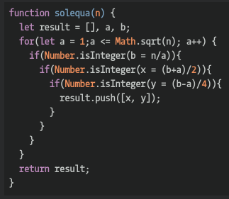

## CodeWars Challenge- 27

In mathematics, a Diophantine equation is a polynomial equation, usually with two or more unknowns, such that only the integer solutions are sought or studied.

In this kata we want to find all integers x, y (x >= 0, y >= 0) solutions of a diophantine equation of the form:

x2 - 4 * y2 = n
where the unknowns are x and y, and n is a given positive number.

in decreasing order of the positive xi. If there is no solution return [] or "[]".

*Examples Given:*

sol_equa(90005) --> [[45003, 22501], [9003, 4499], [981, 467], [309, 37]]
sol_equa(90002) --> []

## Languages Used

1. JavaScript
