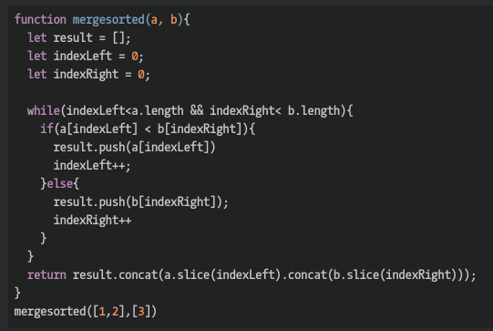

## CodeWars Challenge- 27

In this excercise, we will implement the "merge" function from MergeSort.

MergeSort is often taught in Computer Science as the canonical example of the "Divide and Conquer" algorithm. The strategy of MergeSort is both simple and profound, leveraging two simple-to-prove mathematical facts (1. That every list of 1 element is "sorted" ... and 2. It is much easier to combine two already-sorted lists into 1 sorted list than it is to sort a big list all at once) to yield an algorithm with a worst-case complexity of O(n log n).

Basically, MergeSort works like this:

If we get a list of size 1, then it's already sorted: we're done. Just return that value.
Otherwise; break the list you have to sort in half: 2a. MergeSort the first half. 2b. MergeSort the second half. 2c. "Merge" the two sorted lists for 2a and 2b together. Voila: sorted.
2c is where the MergeSort "merge" function comes in. It takes two already-sorted lists (arrays, in this example) and returns one large sorted list.

The name of the function in this example is "mergesorted". It should return a big sorted array from two smaller sorted arrays.

Since this function is being used in an algorithm, try to optimize for speed and browse the solutions when you're done to see how others approached the problem.

*Examples Given:*

mergesorted([1,2],[3,4]) //should: [1,2,3,4]

mergesorted([1,2],[3]) //should: [1,2,3]

mergesorted([1],[2, 3]) //should: [1,2,3]

## Languages Used

1. JavaScript
