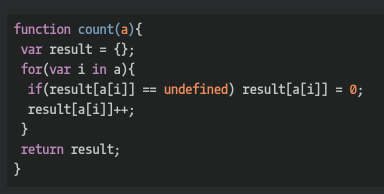

## CodeWars Challenge- 11

Write a function that takes an array and counts the number of each unique element present.

*Examples Given:*

 count(['james', 'james', 'john'])
 #=> { 'james': 2, 'john': 1}

## Languages Used

1. JavaScript
