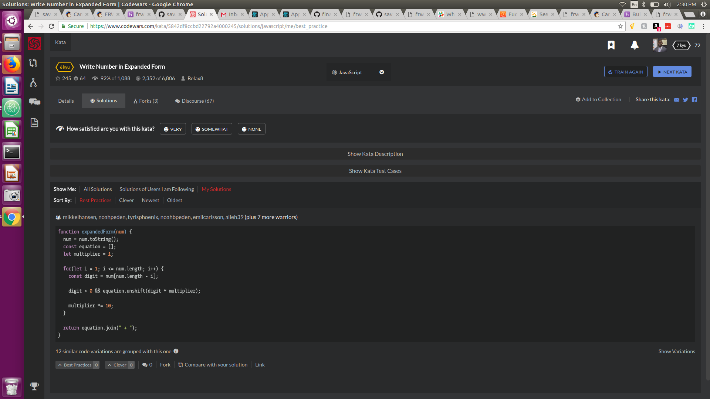

## CodeWars Challenge- 12

You will be given a number and you will need to return it as a string in Expanded Form.

NOTE: All numbers will be whole numbers greater than 0.

*Examples Given:*

expandedForm(12); // Should return '10 + 2'
expandedForm(42); // Should return '40 + 2'
expandedForm(70304); // Should return '70000 + 300 + 4'

## Languages Used

1. JavaScript
