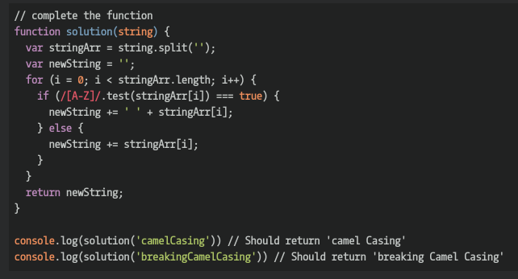

## CodeWars Challenge- 13

Complete the solution so that the function will break up camel casing, using a space between words.

*Examples Given:*

solution('camelCasing') // => should return 'camel Casing'

## Languages Used

1. JavaScript
