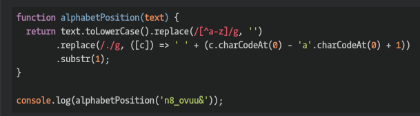

## CodeWars Challenge- 15

Welcome.

In this kata you are required to, given a string, replace every letter with its position in the alphabet.

If anything in the text isn't a letter, ignore it and don't return it.

a being 1, b being 2, etc.

Should return "20 8 5 19 21 14 19 5 20 19 5 20 19 1 20 20 23 5 12 22 5 15 3 12 15 3 11" as a string.

*Examples Given:*

alphabet_position("The sunset sets at twelve o' clock.")

## Languages Used

1. JavaScript
