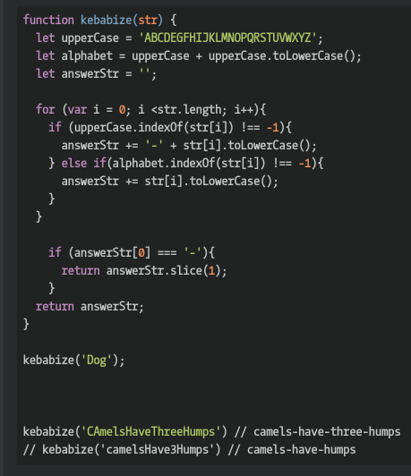

## CodeWars Challenge- 18

Modify the kebabize function so that it converts a camel case string into a kebab case.

Notes:

the returned string should only contain lowercase letters

*Examples Given:*

kebabize('camelsHaveThreeHumps') // camels-have-three-humps
kebabize('camelsHave3Humps') // camels-have-humps

## Languages Used

1. JavaScript
