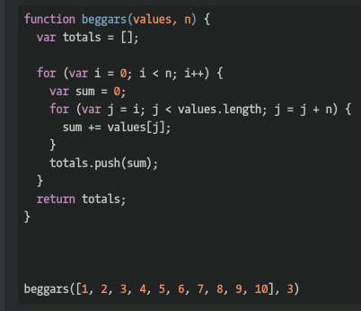

## CodeWars Challenge- 19

Born a misinterpretation of this kata, your task here is pretty simple: given an array of values and an amount of beggars, you are supposed to return an array with the sum of what each beggar brings home, assuming they all take regular turns, from the first to the last.

Note: in case you don't get why this kata is about English beggars, then you are not familiar on how religiously queues are taken in the kingdom ;)

*Examples Given:*

[1,2,3,4,5] for 2 beggars will return a result of [9,6], as the first one takes [1,3,5], the second collects [2,4].

The same array with 3 beggars would have in turn have produced a better out come for the second beggar: [5,7,3], as they will respectively take [1,4], [2,5] and [3].

Also note that not all beggars have to take the same amount of "offers", meaning that the length of the array is not necessarily a multiple of n; length can be even shorter, in which case the last beggers will of course take nothing (0).

## Languages Used

1. JavaScript
