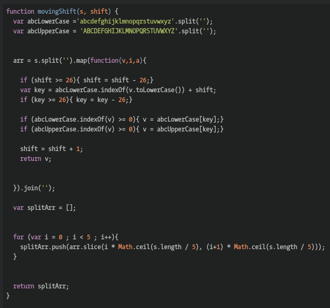

 (codeWars23a.png)

## CodeWars Challenge- 23

The action of a Caesar cipher is to replace each plaintext letter with a different one a fixed number of places up or down the alphabet.

This program performs a variation of the Caesar shift. The shift increases by 1 for each character (on each iteration).

If the shift is initially 1, the first character of the message to be encoded will be shifted by 1, the second character will be shifted by 2, etc...

Coding: Parameters and return of function "movingShift"
param s: a string to be coded

param shift: an integer giving the initial shift

The function "movingShift" first codes the entire string and then returns an array of strings containing the coded string in 5 parts (five parts because, to avoid more risks, the coded message will be given to five runners, one piece for each runner).

If possible the message will be equally divided by message length between the five runners. If this is not possible, parts 1 to 5 will have subsequently non-increasing lengths, such that parts 1 to 4 are at least as long as when evenly divided, but at most 1 longer. If the last part is the empty string this empty string must be shown in the resulting array.

For example, if the coded message has a length of 17 the five parts will have lengths of 4, 4, 4, 4, 1. The parts 1, 2, 3, 4 are evenly split and the last part of length 1 is shorter. If the length is 16 the parts will be of lengths 4, 4, 4, 4, 0. Parts 1, 2, 3, 4 are evenly split and the fifth runner will stay at home since his part is the empty string. If the length is 11, equal parts would be of length 2.2, hence parts will be of lengths 3, 3, 3, 2, 0.

You will also implement a "demovingShift" function with two parameters

Decoding: parameters and return of function "demovingShift"
1) an array of strings: s (possibly resulting from "movingShift", with 5 strings)

2) an int shift

"demovingShift" returns a string.

*Examples Given:*

u = "I should have known that you would have a perfect answer for me!!!"

movingShift(u, 1) returns :

v = ["J vltasl rlhr ", "zdfog odxr ypw", " atasl rlhr p ", "gwkzzyq zntyhv", " lvz wp!!!"]

(quotes added in order to see the strings and the spaces, your program won't write these quotes, see Example Test Cases)

and demovingShift(v, 1) returns u.

## Languages Used

1. JavaScript
