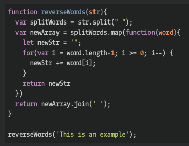

## CodeWars Challenge- 24

Write a reverseWords function that accepts a string a parameter, and reverses each word in the string. Any spaces in the string should be retained.

*Examples Given:*

reverseWords("This is an example!"); // returns  "sihT si na !elpmaxe"
reverseWords("double  spaces"); // returns  "elbuod  secaps"

## Languages Used

1. JavaScript
