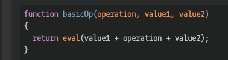

## CodeWars Challenge- 5

Description:

Your task is to create a function - basic_op().

The function should take three arguments - operation(string/char), value1(number), value2(number). The function should return result of numbers after applying the chosen operation.

*Examples Given:*

basicOp('+', 4, 7)         // Output: 11
basicOp('-', 15, 18)       // Output: -3
basicOp('*', 5, 5)         // Output: 25
basicOp('/', 49, 7)        // Output: 7

## Languages Used

1. JavaScript
