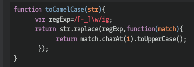

## CodeWars Challenge- 8

Description:

Complete the method/function so that it converts dash/underscore delimited words into camel casing. The first word within the output should be capitalized only if the original word was capitalized.

*Examples Given:*

// returns "theStealthWarrior"
toCamelCase("the-stealth-warrior")

// returns "TheStealthWarrior"
toCamelCase("The_Stealth_Warrior")

## Languages Used

1. JavaScript
